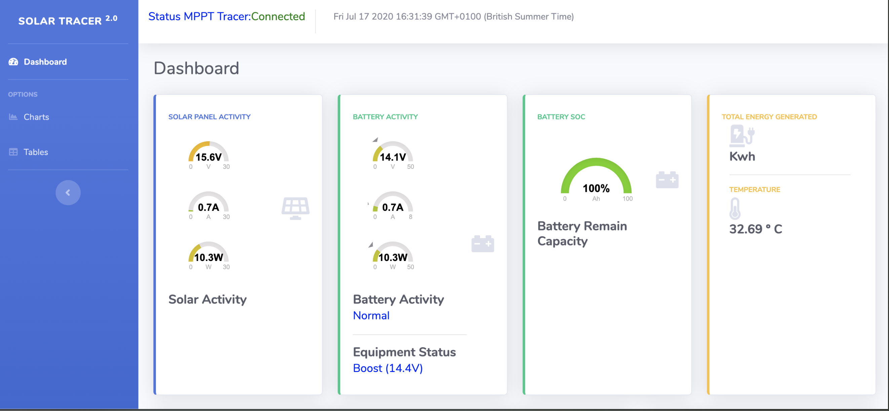

#Solar Tracer Web Monitoring System

# EpSolar Tracer Class Models:
                     
      1.Tracer1206AN 
      2.Tracer2206AN 
      3.Tracer1210AN 
      4.Tracer2210AN 
      5.Tracer3210AN
      6.Tracer4210AN
      
 

      
==================================

This project is just an improvement that I found on 
<b>http://randomsporadicprojects.blogspot.com/ 
<b>https://github.com/toggio/PhpEpsolarTracer</b>

Base on opensource Dashboard running on Rpi Zero with Apache, MySQL, JS and CSS.
You can use it for whatever Rpi version.
 
Library for communicating with Epsolar/Epever Tracer 1206AN MPPT Solar Charger Controller

Features
--------------------------------------
This library connects via RS485 port to the widely known Epsolar/Epever Tracer AN Series MPPT solar charger controller 
(mine is Tracer1206AN) allowing users to get data such as:
 1. Battery Voltage 
 2. Load Current 
 3. Panel Power and base on the [Tracer protocol] [protocol] (Modbus).
 
1. On this file is possible to query the protocols to use solarpi/pdf/1733_modbus_protocol.pdf

In order to get it to work you just need tu use a cheap USB/RS485 converter and connect one side to your PC/Raspberry USB
port and the other to the solar charger's connector and will produce the following output on my solar charger:

Info Data
----------------------------------
* 00 Manufacturer: EPsolar Tech co., Ltd
* 01 Model: Tracer2215BN
* 02 Version: V02.13+V07.24

Rated Data
----------------------------------
* 00 PV array rated voltage: 150V
* 01 PV array rated current: 20A
* 02 PV array rated power: 520W
* 03 Battery rated voltage: 24V
* 04 Rated charging current: 20A
* 05 Rated charging power: 520W
* 06 Charging Mode: 2
* 07 Rated load current: 20A

RealTime Data
----------------------------------
* 00 PV array voltage: 13.37V
* 01 PV array current: 0.01A
* 02 PV array power: 0.24W
* 03 Battery voltage: 12.34V
* 04 Battery charging current: 0.02A
* 05 Battery charging power: 0.24W
* 06 Load voltage: 12.34V
* 07 Load current: 0.64A
* 08 Load power: 7.89W
* 09 Battery temperature: 25°C
* 10 Charger temperature: 20.45°C
* 11 Heat sink temperature: 20.45°C
* 12 Battery SOC: 12%
* 13 Remote battery temperature: 25°C
* 14 System rated voltage: 12V
* 15 Battery status: 0
* 16 Equipment status: 11

Statistical Data
----------------------------------
* 00 Max input voltage today: 88.36V
* 01 Min input voltage today: 1.73V
* 02 Max battery voltage today: 15.5V
* 03 Min battery voltage today: 12.01V
* 04 Consumed energy today: 0.15KWH
* 05 Consumed energy this month: 2.39KWH
* 06 Consumed energy this year: 12.81KWH
* 07 Total consumed energy: 13.4KWH
* 08 Generated energy today: 0.26KWH
* 09 Generated energy this moth: 3.56KWH
* 10 Generated energy this year: 16.55KWH
* 11 Total generated energy: 17.01KWH
* 12 Carbon dioxide reduction: 0.01T
* 13 Net battery current: -0.6A
* 14 Battery temperature: 25°C
* 15 Ambient temperature: 25°C

Settings Data
----------------------------------
* 00 Battery type: 0
* 01 Battery capacity: 50Ah
* 02 Temperature compensation coeff.: 3mV/°C/2V
* 03 High voltage disconnect: 16V
* 04 Charging limit voltage: 15V
* 05 Over voltage reconnect: 15V
* 06 Equalization voltage: 14.6V
* 07 Boost voltage: 14.4V
* 08 Float voltage: 13.8V
* 09 Boost reconnect voltage: 13.2V
* 10 Low voltage reconnect: 12.9V
* 11 Under voltage recover: 12.2V
* 12 Under voltage warning: 12V
* 13 Low voltage disconnect: 11.4V
* 14 Discharging limit voltage: 11V
* 15 Realtime clock (sec): 25
* 16 Realtime clock (min): 26
* 17 Realtime clock (hour): 18
* 18 Realtime clock (day): 13
* 19 Realtime clock (month): 3
* 20 Realtime clock (year): 16
* 21 Equalization charging cycle: 30 day
* 22 Battery temp. warning hi limit: 65°C
* 23 Battery temp. warning low limit: -39.99°C
* 24 Controller temp. hi limit: 85°C
* 25 Controller temp. hi limit rec.: 75°C
* 26 Components temp. hi limit: 85°C
* 27 Components temp. hi limit rec.: 75°C
* 28 Line impedance: 0mOhm
* 29 Night Time Threshold Volt: 5V
* 30 Light signal on delay time: 10 min.
* 31 Day Time Threshold Volt: 6V
* 32 Light signal off delay time: 10 min.
* 33 Load controlling mode: 0
* 34 Working time length1 min.: 0
* 35 Working time length1 hour: 1
* 36 Working time length2 min.: 0
* 37 Working time length2 hour: 1
* 38 Turn on timing1 sec: 0
* 39 Turn on timing1 min: 0
* 40 Turn on timing1 hour: 19
* 41 Turn off timing1 sec: 0
* 42 Turn off timing1 min: 0
* 43 Turn off timing1 hour: 6
* 44 Turn on timing2 sec: 0
* 45 Turn on timing2 min: 0
* 46 Turn on timing2 hour: 19
* 47 Turn off timing2 sec: 0
* 48 Turn off timing2 min: 0
* 49 Turn off timing2 hour: 6
* 50 Length of night min.: 27
* 51 Length of night hour: 11
* 52 Battery rated voltage code: 0
* 53 Load timing control selection: 0
* 54 Default Load On/Off: 1
* 55 Equalize duration: 120 min.
* 56 Boost duration: 120 min.
* 57 Dischargning percentage: 80%
* 58 Charging percentage: 100%
* 59 Management mode: 0

The number at the beginning of every line rapresent the array index

Steps to install the website

1. Clone the repository in your www folder 
2. Execute ./install.sh 
3. Copy from solarpi/db/create_database.txt and paste in your SQL editor
4. Execute crontab -e and add */30 * * * * sudo /var/www/html/solarpi/getsolarstats.php

Enjoy!! 

Note
------
If you use this class in HTTPD and not CLI don't forget to give the user the permssion to use serial port (for example
with Apache on Debian: usermod -a -G dialout www-data)

Contributors
--------

http://arduinoelectronics.wordpress.com/ ~ http://minibianpi.wordpress.com

 * THIS PROGRAM COMES WITH ABSOLUTELY NO WARRANTIES !
 * USE IT AT YOUR OWN RISKS !

[//]: #
[protocol]: <http://www.solar-elektro.cz/data/dokumenty/1733_modbus_protocol.pdf>
   
[Link]: https://iconos8.es/icons/set/moon